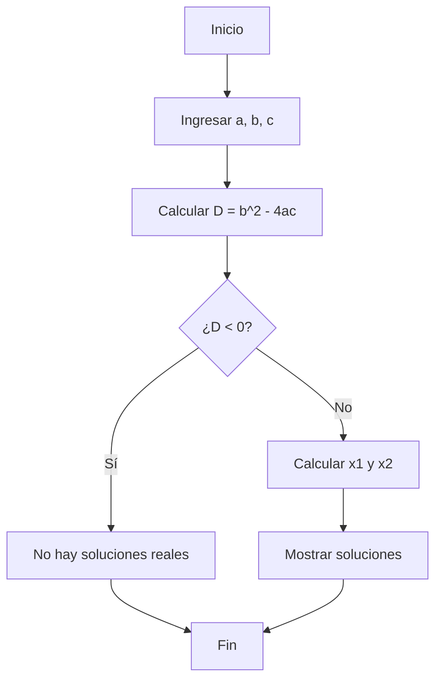

```mermaid
flowchart TD
    A[Inicio] --> B[Ingresar a, b, c]
    B --> C[Calcular D = b^2 - 4ac]
    C --> D{¿D < 0?}
    D -- Sí --> E[No hay soluciones reales]
    D -- No --> F[Calcular x1 y x2]
    F --> G[Mostrar soluciones]
    E --> H[Fin]
    G --> H[Fin]
```
